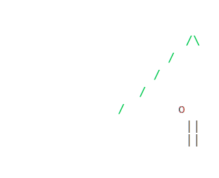

### Hi, I’m Connor
**SWE @ WISE • Computer Engineering @ Villanova • Radar & Data**

---

## About Me

- Interested in **data systems, full-stack web apps, and embedded systems**
- 🏎️ Lead data analysis & acquistion for **Formula SAE** team (NovaRacing)

---

## Tech I Work With

**Languages:**  
`C` · `C++` · `Python` · `TypeScript` · `JavaScript` · `Java`

**Backend / Cloud:**  
`Node.js` · `tRPC` · `PostgreSQL` · `MongoDB` · `AWS` · `GCP` · `Docker` · `Terraform`

**Frontend / UI:**  
`React` · `Next.js` · `Tailwind CSS`

**Data / Tools:**  
`Amplitude` · `Stripe` · `Supabase` · `GCS` · `Git` · `GitHub`
